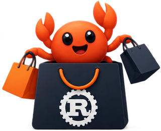

# rustashop

<p align="center">
  
  
</p>

<p align="center">
  
</p>

<p align="center">
  <strong>Modern commerce. Rust powered. AI native.</strong>
</p>

One **Rust** commerce API. **Angular** or **rangular** clients on the same OpenAPI and realtime contracts. rangular targets **two renderers**: Leptos (web/DOM) and GPUI (native GPU). See [`../docs-dev/UI-RENDERERS.md`](../docs-dev/UI-RENDERERS.md).

AI is built into the product map (discovery, shopping agents, catalog assist, pricing, support, MCP, autonomous agents), not glued on later. See [`../docs-dev/AI-NATIVE.md`](../docs-dev/AI-NATIVE.md).

**Status:** catalog read API, OpenAPI / Swagger UI, and local Postgres. Cart and checkout are not in yet.

## What we are building

| Piece            | Role                                                                                        |
| ---------------- | ------------------------------------------------------------------------------------------- |
| **Commerce API** | Catalog, cart, checkout, orders, money (integers), inventory, payments, webhooks            |
| **HTTP stack**   | **Actix-web** kernel (REST, OpenAPI, WebSocket); **Axum** MCP / agent tools (house pattern) |
| **UI A**         | Angular storefront / admin (TypeScript)                                                     |
| **UI B**         | rangular: **Leptos** web renderer + **GPUI** native renderer (same authoring model)         |
| **Realtime**     | WebSocket-first live cart, stock, orders                                                    |
| **Extensions**   | WIT / Component Model plugins; Wasmer sandboxes for polyglot / agents                       |
| **AI**           | Native tools and agents on the same API + MCP                                               |

We learn from PrestaShop, Sylius, Magento, WooCommerce, and OpenCart without cloning PHP. Case-study notes: GitHub issue [#29](https://github.com/Interchouette-ITC/rustashop/issues/29) and [`../docs-dev/`](../docs-dev/).

## Domains

| Host                           | Role                                                |
| ------------------------------ | --------------------------------------------------- |
| `rustashop.interchouette.net`  | First `:dev` image tip (Render service by operator) |
| `rustashop.ai`                 | Primary marketing                                   |
| `rustashop.io`                 | Product-oriented                                    |
| `rustashop.dev`                | Demo                                                |
| `rustashop.app`                | Ionic app                                           |
| `rustashop.nl` / `.eu` / `.fr` | Redirect → `.ai` for now                            |

Detail: [`../docs-dev/DOMAINS.md`](../docs-dev/DOMAINS.md).

## MVP slice

- [ ] Catalog, cart, checkout, one payment provider, orders + basic admin
- [ ] Both UI clients on the same API
- [ ] OpenAPI + compose for local run
- [ ] Foundations wired so AI, realtime, and extensions are not retrofit surprises

Out of v0.1: marketplace, full promotions engine, Magento import wizard.

## Local stack

Postgres plus the Actix API:

```bash
docker compose up --build
curl http://127.0.0.1:8080/healthz
curl http://127.0.0.1:8080/v1/products
```

Swagger UI is at `/swagger-ui/`. `make openapi` writes `openapi/openapi.json`.

Host API against compose Postgres only: `make db-up && make db-migrate && make run-api`. Do not bind port `8080` twice.

## Docs

- [`ARCHITECTURE.md`](ARCHITECTURE.md) - crates, HTTP split, request path
- [`CONTRIBUTING.md`](CONTRIBUTING.md) - make targets, lint bar, PR habits
- [`../docs-dev/README.md`](../docs-dev/README.md) - foundations index (Wasm, realtime, AI, domains)
- Brand sizes: [`brand/`](brand/)

Framework: [serenade](https://github.com/Interchouette-ITC/Serenade). Kernel wire: [#49](https://github.com/Interchouette-ITC/rustashop/issues/49).

**rangular** is upstream UI tooling. Template language changes belong there; commerce domain belongs here.

## Contributing

1. Read [`ARCHITECTURE.md`](ARCHITECTURE.md) and [`../docs-dev/`](../docs-dev/).
2. Follow [`CONTRIBUTING.md`](CONTRIBUTING.md) (`make lint`, `make test`).
3. Open issues for domain or AI/tool surface debates.
4. Commits and docs in **English**; conventional commits when code lands.

<p align="center">
  
</p>

## Thanks

**rustashop** will stand on excellent open-source projects and hosts:

| Project                                                                                   | Role here                                          |
| ----------------------------------------------------------------------------------------- | -------------------------------------------------- |
| [Rust](https://www.rust-lang.org/)                                                        | Commerce API and workers                           |
| [Actix Web](https://actix.rs/)                                                            | Main commerce HTTP API, OpenAPI, WebSocket gateway |
| [Axum](https://github.com/tokio-rs/axum)                                                  | MCP and narrow agent/tool HTTP surfaces            |
| [Angular](https://angular.dev/)                                                           | UI option A                                        |
| [rangular](https://github.com/Interchouette-ITC/rangular) / [Leptos](https://leptos.dev/) | UI option B (templates → wasm)                     |
| [Tokio](https://tokio.rs/) (planned)                                                      | Async runtime                                      |
| [PostgreSQL](https://www.postgresql.org/) (planned)                                       | System of record                                   |
| [Render](https://render.com/)                                                             | Hosting tip / demos (operator-owned services)      |

Thank you to their maintainers and communities.

## License

**OSL-3.0** (Open Software License v3.0). See [`LICENSE`](../LICENSE).

<p align="center">
  
</p>
